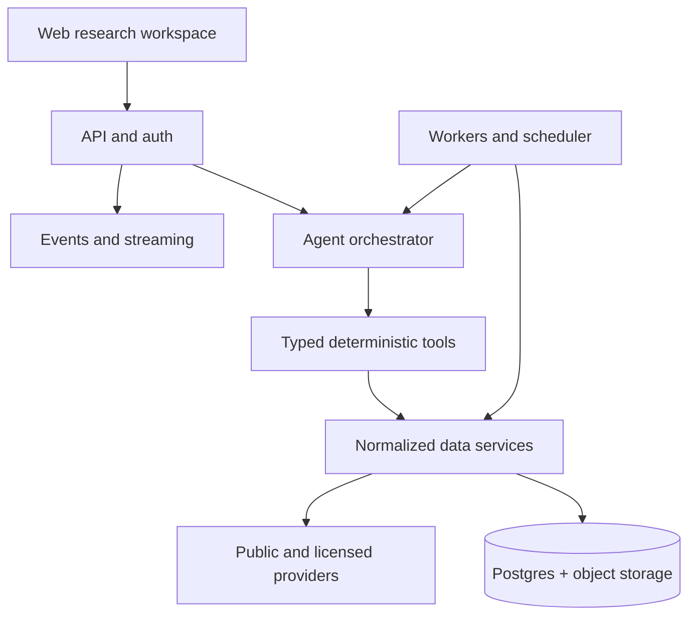

# Proposed Architecture

## Shape



## Core components

### Web research workspace

- conversation threads and streamed tool status;
- chart with structured `ChartContext`;
- watchlists and saved research artifacts;
- evidence/freshness drawer;
- explicit confirmation for mutations.

### API and identity

- authentication, tenants, quotas, and authorization;
- REST for resources and SSE/WebSocket for streaming;
- request IDs and audit events;
- no provider credentials in the browser.

### Agent orchestrator

- provider-neutral model adapter;
- typed tool registry;
- bounded planning loop;
- per-request time, token, provider-call, and dollar budgets;
- confirmation policy for watchlist/alert mutations;
- evidence-preserving synthesis;
- stores tool inputs/outputs and summaries, not hidden chain-of-thought.

### Deterministic tool layer

Representative contracts:

```text
resolve_symbol(query, as_of?) -> InstrumentIdentity[]
get_price_bars(instrument_id, interval, start, end, adjustment) -> BarSeries
compute_indicators(series_ref, indicators[]) -> IndicatorSeries[]
get_company_facts(instrument_id, concepts[], as_of?) -> FactObservation[]
search_filings(instrument_id, forms[], start, end, query?) -> DocumentHit[]
get_macro_series(series_id, start, end, vintage?) -> MacroSeries
run_scan(universe_ref, expression, as_of) -> ScanResult
run_backtest(strategy_spec, universe_ref, range, cost_model) -> BacktestResult
```

The LLM never returns an authoritative numeric result without a tool result supporting it.

### Data plane

Separate four layers:

1. raw immutable responses/documents;
2. normalized point-in-time observations;
3. derived series/features with code-version lineage;
4. query/read models optimized for product workflows.

Postgres is sufficient initially. Add TimescaleDB/ClickHouse only after query measurements. Use object storage for source documents, compressed raw payloads, and larger columnar snapshots. Redis handles short-lived queues/caches, not authoritative state.

### Background jobs

- ingestion and reconciliation;
- document extraction/chunking;
- scheduled scans and alerts;
- deep-research fan-out/fan-in;
- backfills and reprocessing;
- retention and license-policy enforcement.

## Canonical entities

- `Instrument` and temporal `SymbolMapping`
- `Venue`, `TradingSession`, and `CorporateAction`
- `Bar`, `Quote`, and `TradeObservation`
- `FundamentalFact` with filing/accession, period, unit, form, filed time, and restatement lineage
- `Document` and `DocumentChunk`
- `EventObservation`
- `FeatureSeries` with calculation/version metadata
- `Source`, `LicensePolicy`, and `IngestionRun`
- `Workspace`, `Thread`, `Watchlist`, `Alert`, and `ResearchArtifact`
- `AgentRun`, `ToolCall`, `EvidenceItem`, and `AuditEvent`

Every observation should answer: who published it, what it describes, when it was true, when it became knowable, when it was retrieved, how it was transformed, and whether it may be retained/displayed.

## Deep-research execution

1. Parent run resolves the universe and estimates cost.
2. User confirms when the estimate crosses the configured threshold.
3. Coordinator creates one bounded symbol job per target.
4. Workers retrieve evidence and return typed partial reports.
5. Parent synthesizes only completed evidence, identifies failures, and cites each conclusion.
6. Cancellation stops queued work and marks partial artifacts reusable.

Do not allow recursive uncontrolled agent spawning. Set hard concurrency and total-work limits.

## Backtesting requirements

- event time and knowledge time are separate;
- use historical universe membership when available;
- define split/dividend adjustment and execution price explicitly;
- prevent use of filings, estimates, macro revisions, or events before publication;
- model commissions, spread/slippage, liquidity constraints, and session rules;
- persist strategy spec, data snapshot/version, code SHA, and complete trade log;
- distinguish research simulation from executable trading.

## Security and compliance

- secrets manager in deployed environments;
- per-provider credential scopes and rotation;
- tenant isolation and row-level authorization;
- outbound allowlist for ingestion workers where practical;
- audit all state-changing tools;
- sanitize documents against prompt injection and treat retrieved text as untrusted data;
- rate limits, circuit breakers, and spend caps;
- retention/redistribution enforcement based on source policy;
- financial disclaimer and jurisdiction review before public launch.

## Deployment path

### Local

- Docker Compose: API, worker, Postgres, Redis;
- fixture provider for all tests;
- optional live adapters enabled only by environment variables.

### Initial cloud

- managed container service for API and workers;
- managed Postgres and Redis;
- object storage;
- queue/scheduler;
- hosted secrets and observability;
- CDN/static hosting for web client.

### Scale triggers

Add dedicated time-series/analytical storage, Kafka-like streaming, GPU services, or distributed backtesting only after measured bottlenecks. Market-data licensing and provider rate limits will often constrain the system before compute does.

## Evaluation

Maintain an offline golden set covering:

- symbol ambiguity and ticker changes;
- corporate actions and adjusted/unadjusted prices;
- filing restatements and point-in-time facts;
- missing/stale/contradictory sources;
- tool-selection accuracy;
- numeric and citation correctness;
- scan/backtest determinism;
- prompt-injection attempts in filings/news;
- cost, latency, cancellation, and partial deep-research results.
